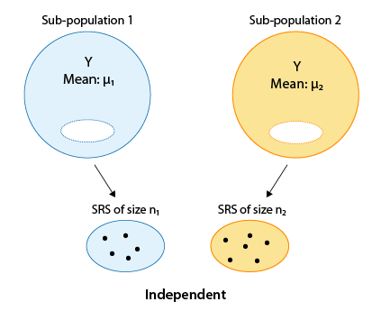
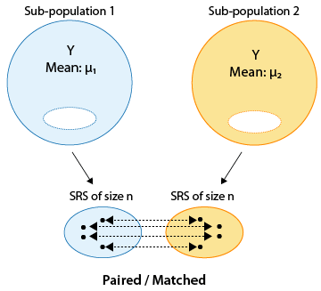

## Announcements

- HW 4 due Tonight at 11:59pm.

- Lab 4 due Tomorrow (Friday) at 11:59pm.

- **No class** and **No lab session** on Tuesday 10/7, Wellness Day! (No lab assignment next week.)

- HW 5 will be released after class. HW 5 is due next **Thursday 10/9 at 11:59pm**.

## Course feedback

On Canvas, fill out the short survey on how lab went this week and on potential alternate tutoring times. 


## Overview

- Review hypothesis test framework

- Independent 2-sample t-test vs. paired t-test

- Example: independent 2-sample t-test, licorice treatment

- Example: paired t-test, exercise plan

## Reading

-   P&G: Chapter 11

-   OI: 7.3

## Review: Hypothesis testing steps

::: callout-tip

## Fill in the blanks

1.  State the null and alternative hypotheses. The null hypothesis states “____________________________” and the alternative challenges it.

2.  Collect relevant data and summarize it

3.  Assess how surprising it would be to see data like that if the _________________________ were really true

4.  Draw conclusions

:::


## Independent samples {.smaller}

-   The type of t-test we use to compare two means depends on how the samples were obtained. One approach would be to obtain **two independent samples** and test the equality of means $\mu_1$ and $\mu_2$

{width="200"}

## Paired or matched samples {.smaller}

-   An alternative would be to obtain **paired** or **matched samples** and test the equality of means $\mu_1$ and $\mu_2$.

-   Matching could be by person (e.g., before and after measures) or could be a pair of individuals who belong together in another way (e.g., same date of birth in same hospital; married couple, twins etc.)

{width="200"}

## Paired samples

Samples are often paired for a variety of reasons

-   Measurements are taken on a single subject at two distinct points in time (e.g., baseline and follow-up)

-   Subjects may be matched so that members of each pair are as much alike as possible with respect to important characteristics like age and sex (e.g., matched case-control study)

Pairing can **control for unwanted sources of variation** that might otherwise influence the results of a comparison. Matching within subject (e.g., baseline and follow-up) is a powerful way to eliminate subject-specific factors.

## Designing a study: impaired driving

The Department of Motor Vehicles wishes to compare impairment of drivers while texting to impairment after being sleep deprived for 24 hours.

::: {.callout-tip appearance="simple"}
In small groups, describe an independent samples design and a matched pairs design for this question of interest.
:::

## Case study: licorice and surgery {.smaller}

-   Reutzler et al. (2013) performed an experiment among patients having surgery who required intubation.

-   Prior to anesthesia, patients were randomly assigned to gargle either a licorice-based solution or sugar water (as placebo). 

- Sore throat was evaluated 30 minutes, 90 minutes, and 4 hours after conclusion of the surgery on a pain scale from 0 to 10 (0 = no pain; 10 = worst).

-   Let's evaluate whether **gargling licorice before surgery** led to **different mean pain scores** when swallowing, at 30 minutes after arrival in the PACU (post-anesthesia care unit).

## Case study: hypothesis testing step 1

- The null hypothesis is that patients receiving licorice gargle (`treat` = 1) and sugar solution (`treat` = 0) placebo have the same mean pain scores relating to swallowing 30 minutes after arrival in the PACU, `pacu30min_swallowPain`, (treatment is unrelated to mean pain), while the alternative is that they do not.

::: {.callout-tip appearance="simple"}
What are the null and alternative hypotheses written out in symbols?
:::

## Setup

- First, we can load tidyverse and read in our data.

```{r}
#| echo: true
library(tidyverse)
licorice <- read.csv("data/licorice.csv")
```

Variables of interest:

- `treat`: Treatment given (0 = Sugar placebo; 1 = Licorice solution)

- `pacu30min_swallowPain`: Swallow pain score 4 hours after surgery (11-point scale:
0 = No pain; 10 = worst pain)

## Looking at some data

```{r echo = T}
licorice |>
  select(pacu30min_swallowPain, treat) |>
  slice(1:5)
```

```{r echo = T}
licorice |>
  count(treat)
```


## Step 2 continued

```{r echo = T}
licorice |>
  group_by(treat) |> 
  summarize(mean = mean(pacu30min_swallowPain), 
            sd = sd(pacu30min_swallowPain))
```

Analyzing the data, we obtained

-   $\bar{x}_L$=0.308

-   $\bar{x}_S$=1.38

-   $s_L$=0.825

-   $s_S$=2.29

## Visualizing the means: code

```{r}
#| echo: true
#| warning: false
#| eval: false
ggplot(licorice, aes(x = as.factor(treat), 
                     y = pacu30min_swallowPain)) +
  geom_boxplot() +
  labs(x = "Treat", y = "Swallow Pain 30 min Post") +
  theme_minimal()
```

## Visualizing the means: plot

```{r}
#| echo: false
#| warning: false
#| eval: true
ggplot(licorice, aes(x = as.factor(treat), 
                     y = pacu30min_swallowPain)) +
  geom_boxplot() +
  labs(x = "Treat", y = "Swallow Pain 30 min Post") +
  theme_minimal() 
```

## Two-sample t-test, independent samples

The two-sample t-test for independent samples is given by

::: poll
$$t = \frac{(\bar{x}_1 - \bar{x}_2) - (\mu_1 - \mu_2)}{\sqrt{\frac{s_1^2}{n_1} + \frac{s_2^2}{n_2}}}$$
:::

The degrees of freedom of the $t$ statistic depend on whether or not $\sigma_1^2 = \sigma_2^2$.

## Equal or unequal variances? {.smaller}

-   The choice of $df$ depends on whether the independent samples have the same or different variances

-   If the variances are equal, then we can use a pooled estimate of $s^2$, and the degrees of freedom are given by $(n_1−1)+(n_2−1)=n_1+n_2−2$.

-   If the variances are unequal, the degrees of freedom are difficult to derive, and something called a **Satterthwaite approximation** is often used (use software).

-   Unequal variances is the default in `t.test()` (and it should be the default choice), as the t-test assuming equal variances can be quite unreliable if the variances differ, especially when the group sizes differ as well. 

## Case study: hypothesis testing step 3

```{r echo = T}
t.test(pacu30min_throatPain ~ treat, 
       data = licorice,
       mu = 0,
       alternative = "two.sided",
       var.equal = FALSE,
       conf.level = 0.95)
```

## Case study: hypothesis testing step 3

Carrying out the two sample t-test for independent samples with unequal variances using software on the previous slide, we get $t=4.80$, $df$≈157.3, with a corresponding p-value \< 0.001.

## Case study: hypothesis testing step 4 {.smaller}

-   **Conclusion**: Based on our observed data, we conclude that there is evidence of a potential difference in mean pain score between the two groups. In particular, we have evidence that those receiving the licorice gargle before their surgery reported a lower mean pain score compared to placebo patients.

{width="400"}


## Case study: athletic training

-   A school athletics department wants to test the effectiveness of the new type of training proposed by comparing the average times of 10 runners in the 100 meters in seconds before and after the new training is implemented.

::: {.callout-tip appearance="simple"}
-   What are $H_0$ and $H_1$?

-   Which test should we use?
:::

## In R

-   Our dataset in R is called `training`:

```{r echo = F}
subject <- 1:10
before <- c(12.9, 13.5, 12.8, 15.6, 17.2, 19.2, 12.6, 15.3, 14.4, 11.3)
after <- c(12, 12.2, 11.2, 13.0, 15, 15.8, 12.2, 13.4, 12.9, 11)
training <- data.frame(subject, before, after)

```

```{r}
#| echo: true
training
```


## Paired t-test

```{r echo = T}
t.test(training$before, 
       training$after, 
       mu = 0,
       paired = T,
       alternative = "two.sided",
       var.equal = FALSE,
       conf.level = 0.95)
```


## Conclusion

::: callout-tip

What is your conclusion?

:::

## But wait...


```{r}
#| echo: true
training_diff <- training |> 
  mutate(diff = after - before)
training_diff
```

## But wait..

```{r}
t.test(training_diff$diff, 
       mu = 0,
       alternative = "two.sided",
       conf.level = 0.95)
```
## Takeaway

- A paired t-test is the same as a one-sample t-test on the differences. 

## Recap

- Review hypothesis test framework

- Independent 2-sample t-test vs. paired t-test

- Example: independent 2-sample t-test, licorice treatment

- Example: paired t-test, exercise plan


## Next class

- No class on Tuesday. Enjoy your Wellness Day.

- Thursday's class: ANOVA